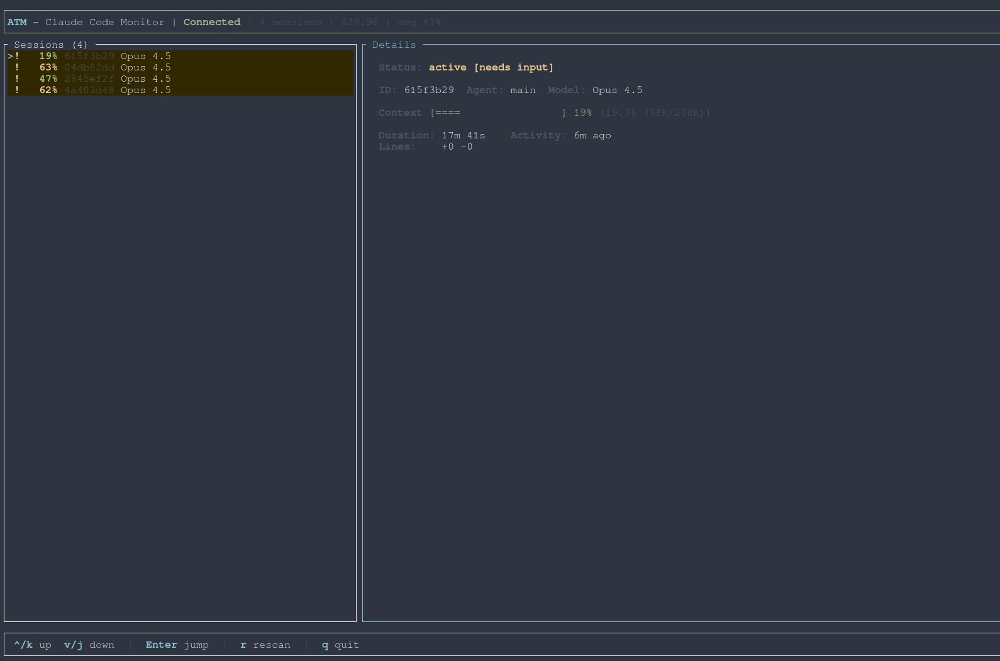

# Agent Tmux Manager (ATM)

[](https://github.com/damelLP/agent-tmux-manager/actions)
[](LICENSE)

Real-time management for Claude Code agents across tmux sessions.



## What it does

ATM gives you a live dashboard and CLI for every Claude Code agent running in tmux. You can see context usage, cost, model, and activity at a glance — and control agents without switching panes.

It consists of two binaries:

- **`atmd`** — background daemon that collects status from Claude Code hooks
- **`atm`** — TUI dashboard + CLI for interacting with agents

## Install

### Quick install

```bash
curl -sSL https://raw.githubusercontent.com/damelLP/agent-tmux-manager/main/scripts/install.sh | sh
```

### Cargo

```bash
cargo install atm
# or
cargo binstall atm
```

Then configure hooks:

```bash
atm setup
```

## Quick start

```bash
atm                    # launch TUI (starts daemon automatically)
```

Sessions appear as you use Claude Code. Press `Enter` to jump to any session, `q` to quit.

## CLI

### Agent management

```bash
atm spawn                          # spawn a new Claude Code agent in a tmux pane
atm spawn -m opus -d right         # spawn with model and split direction
atm kill <target>                  # kill agent and close its pane
atm interrupt <target>             # send SIGINT to stop current turn
atm send <target> "do the thing"   # send text to agent's pane
atm reply <target> --yes           # accept a permission prompt
atm reply <target> --no            # reject a permission prompt
atm reply <target> -o 2            # select option 2
```

### Observability

```bash
atm list                           # table of all agents
atm list -f json                   # JSON output for scripting
atm list --status working          # filter by status
atm peek <target>                  # show visible pane content
atm peek <target> --prompt         # extract just the active prompt
atm status                         # one-line summary (for tmux status bar)
```

### Workspaces

```bash
atm workspace create               # new tmux session with ATM sidebar + agent + shell
atm workspace create --editor       # include an editor pane
atm workspace attach                # inject ATM sidebar into current session
atm workspace attach my-session     # inject into a specific session
```

### Layouts

```bash
atm layout solo                    # single agent
atm layout pair                    # two agents side by side
atm layout squad                   # team of agents
atm layout grid                    # grid arrangement
atm layout grid --session new-ses  # create in a new tmux session
```

### Daemon

```bash
atmd start -d         # start in background
atmd start            # start in foreground (debugging)
atmd status           # check if running
atmd stop             # stop daemon
```

### Setup & teardown

```bash
atm setup             # configure Claude Code hooks
atm uninstall         # remove hooks and clean up
```

## TUI keybindings

| Key | Action |
|-----|--------|
| `j` / `↓` | Move down |
| `k` / `↑` | Move up |
| `Enter` | Jump to session |
| `Tab` | Toggle panels |
| `r` | Rescan |
| `q` | Quit |

## Tmux integration

### Status bar

Add a live agent summary to your tmux status bar:

```tmux
set -g status-right '#(atm status)'
```

### Popup picker

Pop up ATM as a session switcher:

```tmux
bind-key a display-popup -E -w 80% -h 60% "atm --pick"
```

## How it works

```
Claude Code  ──hook──▶  atmd (daemon)  ◀──socket──  atm (TUI/CLI)
```

1. `atm setup` registers hooks in `~/.claude/settings.json`
2. Claude Code fires `PreToolUse`, `PostToolUse`, and `StatusLine` events
3. The hook binary (`atm-hook`) forwards events to `atmd` over a Unix socket
4. `atmd` maintains a session registry and broadcasts updates
5. `atm` connects to `atmd` for real-time display

Sessions go stale after 90s of inactivity and are cleaned up automatically.

## Building from source

```bash
git clone https://github.com/damelLP/agent-tmux-manager.git
cd agent-tmux-manager
cargo build --release
```

Binaries land in `target/release/`: `atm`, `atmd`.

## License

MIT — see [LICENSE](LICENSE).
